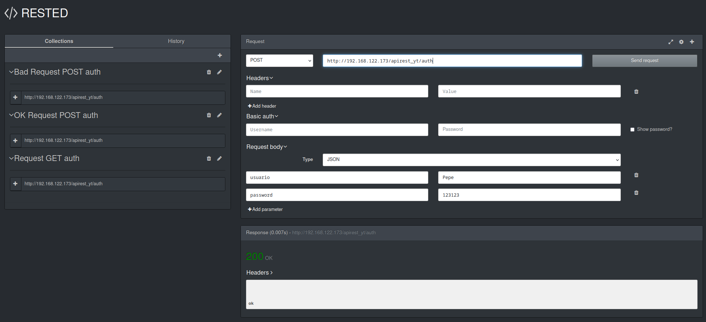

# Apuntes PHP REST API

### Requerimientos

[MariaDB](https://mariadb.com/docs/), [Apache](https://httpd.apache.org/docs/)
y [PHP](https://www.php.net/docs.php). Opcional
[PhpMyAdmin](https://docs.phpmyadmin.net/en/latest/)

```sh
sudo apt install mariadb-server apache2 php-mysql python3-mysqldb php php-cli \
         php-curl php-gd php-json php-mbstring php-mysql php-zip

# opcional
sudo apt install phpmyadmin
```

```sh
sudo systemctl enable mysql
```

### Configuracion Apache2

#### Agregar user a www-data

```sh
sudo usermod -a -G www-data $USER
```

#### Crear regla

Ejemplo usando symlink `html` a `$HOME/projects/apirest` en vez de usar el
directorio `/var/www/html`.

```sh
cd /var/www/
sudo ln -s $HOME/projects/apirest html
```

`/etc/apache2/apache2.conf`

```apache
<Directory /var/www/>
    Options Indexes FollowSymLinks
    AllowOverride All 
    Require all granted
</Directory>

# Para usar phpmyadmin, agregar al final
Include /etc/phpmyadmin/apache.conf
```

#### Activar modulo rewrite

Para usar `.htaccess` específico del proyecto.

```sh
sudo a2enmod rewrite
sudo systemctl restart apache2
```

> ¿Como mostrar errores en php? [stackoverflow](https://stackoverflow.com/questions/1053424/how-do-i-get-php-errors-to-display).

Agregar la sgte. linea en `.htaccess`

```apache
php_flag display_errors 1
```

O modifcar el/los parametro(s) en `/etc/php/8.1/php.ini`

```apache
error_reporting = E_ALL
display_errors = On
```

#### Extension RESTED para Firefox



----

### Inicio del proyecto

Crear y poblar base de datos, según archivo `./original/database/apirest.sql`.

Crear archivo de configuración en la ruta `./<projecto>/clases/conexion/config`.

```json
{
    "conexion":{
        "server" : "127.0.0.1",
        "user" : "<USER>",
        "password" : "<PASWORD>",
        "database" : "apirest",
        "port" : "3306"
    }
}
```
